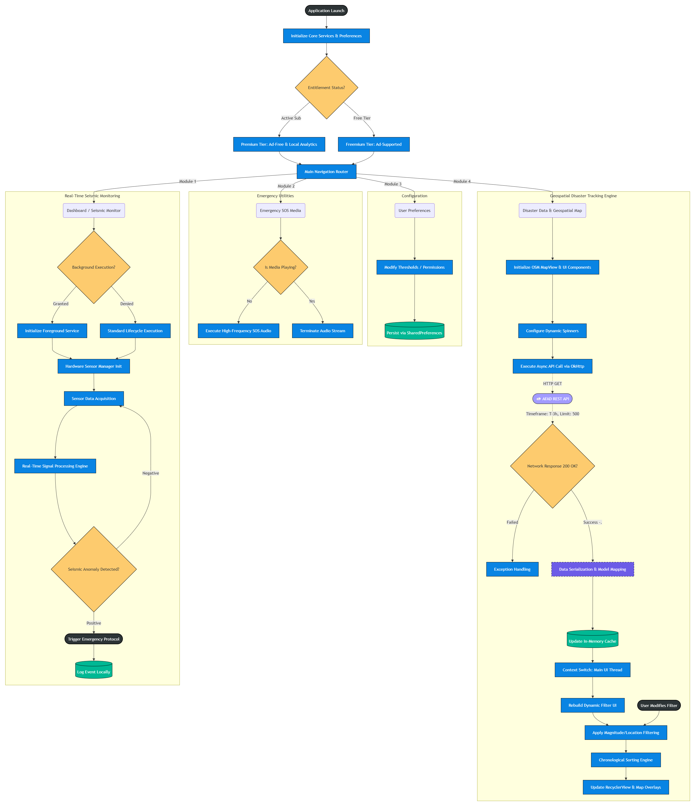

# Earthquake Alert & Tracking System (Deprem Alarmı)

A high-performance, real-time seismic monitoring and disaster tracking application built entirely in **Java**. Independently developed, scaled, and maintained to serve nearly **500,000 users** on the Google Play Store.

  

> **Note:** This repository serves as an architectural showcase. The source code is private due to commercial licensing and active deployment on the Play Store.

---

## 🏗️ System Architecture & Execution Flow

Below is the complete execution flowchart detailing the background sensor logic, asynchronous networking, and UI thread context switching.

  

---

## 🛠️ Tech Stack & Core Libraries

* **Language:** Java
* **Mapping & GIS:** OSMDroid (OpenStreetMap) with custom `GeoPoint` marker clustering.
* **Networking:** `OkHttp` for asynchronous REST API calls.
* **Hardware Integration:** `SensorManager` (Accelerometer threshold detection).
* **Media & Services:** Android `MediaPlayer`, Foreground Services for background monitoring.
* **Local Storage:** `SharedPreferences` (Optimized for minimal footprint instead of SQLite/Room).
* **Monetization:** Google Play Billing Library (In-App Subscriptions) & Google AdMob.

---

## ⚙️ Core Engineering Modules

### 1. Real-Time Seismic Monitoring (Hardware Level)
Utilizes the device's built-in accelerometer to detect sudden seismic anomalies.
* Runs via a highly optimized background service to minimize battery consumption.
* Implements a custom mathematical threshold algorithm to differentiate between normal device handling and actual seismic vibration.

  

### 2. Geospatial Disaster Tracking (Network Level)
Fetches and processes real-time earthquake data from the AFAD (Disaster and Emergency Management Authority) REST API.
* Executes asynchronous `OkHttp` GET requests (T-3h timeframe, 500 event limit) to prevent UI thread blocking.
* Custom JSON parsing and object mapping (`EarthquakeModel`).
* Implements dynamic, memory-efficient in-app filtering (by Magnitude and City) before updating the OSMDroid map overlays and `RecyclerView`.

  

### 3. Emergency Utilities
Integrated SOS functionalities (high-frequency whistle media) accessible under extreme stress conditions, engineered to bypass standard audio focus interruptions when necessary.

  

---

## 🧠 Key Technical Challenges Solved

* **Battery Optimization vs. Continuous Monitoring:** Running continuous sensor listeners normally drains the battery. Solved by managing hardware polling rates strictly within OS lifecycle constraints and shifting heavy calculations off the main thread.
* **High-Volume UI Rendering:** Rendering hundreds of map markers concurrently caused frame drops. Addressed by clearing `MapController` overlays selectively and updating UI components purely via explicit Main UI Thread context switching after data serialization.
* **Lightweight Persistence:** Instead of over-engineering a local SQLite/Room database for simple threshold preferences and local event logs, implemented a robust `SharedPreferences` strategy, drastically reducing app size and read/write latency.

---

## 🔗 Links

* [Download on Google Play Store](https://play.google.com/store/apps/details?id=com.berkehansari.depremalarm)
* [Developer Profile / LinkedIn](https://www.linkedin.com/in/berkehan-sarı/)
